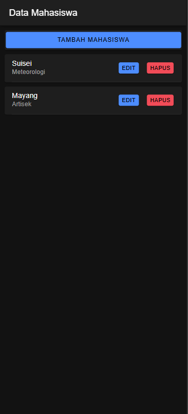
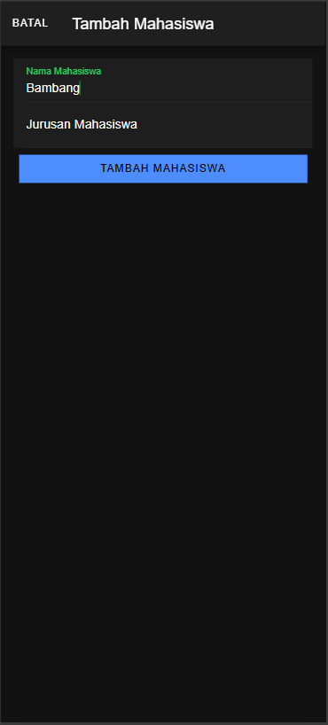
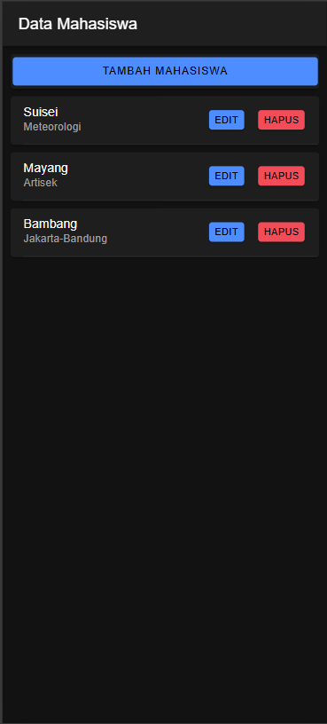
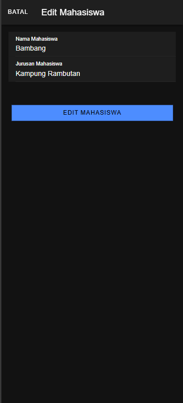
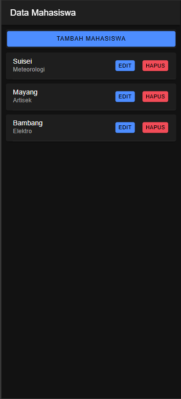
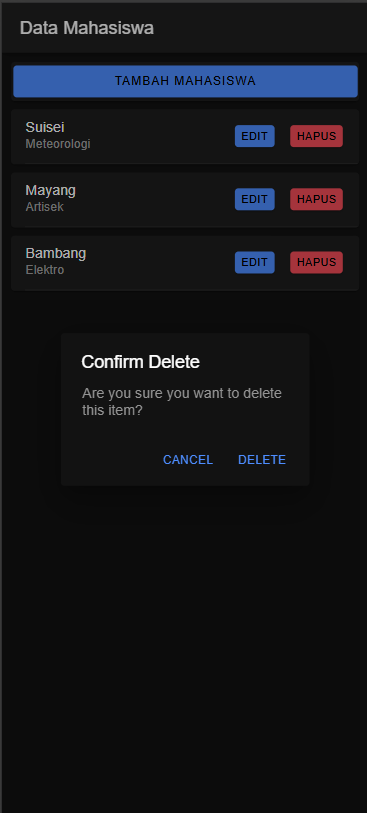
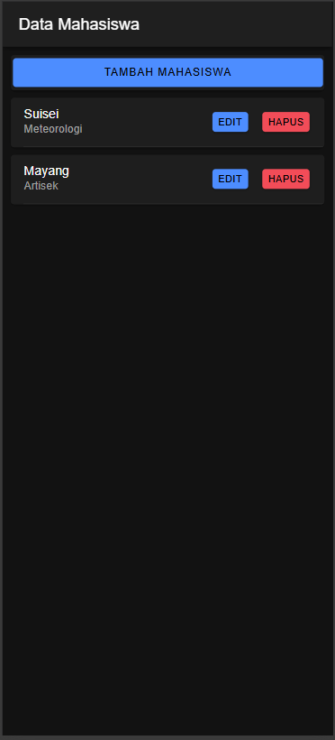
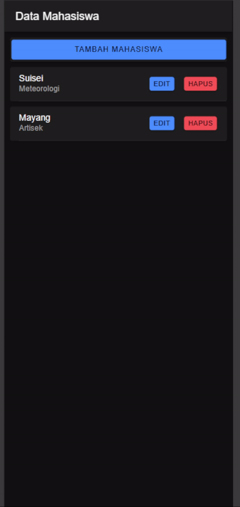

# Tugas 8 PrakPemMob

## Penjelasan

### 1. Tampilan Awal



<p> Pada mahasiswa.page.ts digunakan metode getMahasiswa() untuk mengambil data dari API melalui ApiService. Metode ini dipanggil saat komponen diinisialisasi melalui ngOnInit(), kemudian data yang diterima disimpan dalam variabel dataMahasiswa. Potongan kode berikut menunjukkan pemanggilan API dan penyimpanan data: </p>

```typescript
ngOnInit() {
  this.getMahasiswa();
}

getMahasiswa() {
  this.api.tampil('tampil.php').subscribe({
    next: (res: any) => {
      console.log('sukses', res);
      this.dataMahasiswa = res;
    },
    error: (err: any) => {
      console.log(err);
    },
  });
}
```

### 2. Menambahkan Data Baru



<p> Pada mahasiswa.page.ts, ModalController digunakan untuk menampilkan modal tambah data. Variabel modalTambah, id, nama, dan jurusan dideklarasikan untuk mengelola modal dan data input. Fungsi openModalTambah(isOpen: boolean) membuka modal dan mereset data input, sedangkan cancel() menutup modal. </p>

```typescript
import { ModalController } from '@ionic/angular';

modalTambah: any;
id: any;
nama: any;
jurusan: any;

openModalTambah(isOpen: boolean) {
  this.modalTambah = isOpen;
  this.nama = '';
  this.jurusan = '';
}

cancel() {
  this.modal.dismiss();
  this.modalTambah = false;
}
```

<p> Di mahasiswa.page.html, tombol "Tambah Mahasiswa" memanggil openModalTambah(true) untuk membuka modal. Modal ini berisi form input untuk nama dan jurusan mahasiswa, serta tombol untuk menambahkan data dan tombol "Tambah Mahasiswa" dalam modal menyimpan data yang dimasukkan.</p>

```typescript
  <!-- button tambah -->
  <ion-card>
    <ion-button (click)="openModalTambah(true)" expand="block">
      Tambah Mahasiswa
    </ion-button>
  </ion-card>
  
  <!-- modal tambah -->
  <ion-modal [isOpen]="modalTambah">
    <ng-template>
      <ion-header>
        <ion-toolbar>
          <ion-buttons slot="start">
            <ion-button (click)="cancel()">Batal</ion-button>
          </ion-buttons>
          <ion-title>Tambah Mahasiswa</ion-title>
        </ion-toolbar>
      </ion-header>
      <ion-content class="ion-padding">
        <ion-item>
          <ion-input
            label="Nama Mahasiswa"
            labelPlacement="floating"
            required
            [(ngModel)]="nama"
            placeholder="Masukkan Nama Mahasiswa"
            type="text"
          >
          </ion-input>
        </ion-item>
        <ion-item>
          <ion-input
            label="Jurusan Mahasiswa"
            labelPlacement="floating"
            required
            [(ngModel)]="jurusan"
            placeholder="Masukkan Jurusan Mahasiswa"
            type="text"
          >
          </ion-input>
        </ion-item>
        <ion-row>
          <ion-col>
            <ion-button
              type="button"
              (click)="tambahMahasiswa()"
              color="primary"
              shape="full"
              expand="block"
            >
              Tambah Mahasiswa
            </ion-button>
          </ion-col>
        </ion-row>
      </ion-content>
    </ng-template>
  </ion-modal>
```

### 3. Menampilkan Data Setelah Ditambahkan



### 4. Edit Data



Pertama, ambil data mahasiswa berdasarkan id dan mengisinya ke dalam modal edit. Data ini ditampilkan dalam input form untuk dapat diedit mmenggunakan ambilMahasiswa(id)

```typescript
  ambilMahasiswa(id: any) {
    this.api.lihat(id, 'lihat.php?id=').subscribe({
      next: (hasil: any) => {
        console.log('sukses', hasil);
        let mahasiswa = hasil;
        this.id = mahasiswa.id;
        this.nama = mahasiswa.nama;
        this.jurusan = mahasiswa.jurusan;
      },
      error: (error: any) => {
        console.log('gagal ambil data');
      }
    })
  }
```

Kemmudian, buka modal edit dan panggil ambilMahasiswa() untuk menampilkan data mahasiswa yang dipilih berdasarkan id menggunakan openModalEdit(isOpen: boolean, idget: any).

```typescript
  openModalEdit(isOpen: boolean, idget: any) {
    this.modalEdit = isOpen;
    this.id = idget;
    console.log(this.id);
    this.ambilMahasiswa(this.id);
    this.modalTambah = false;
    this.modalEdit = true;
  }
```

Fungsi editMahasiswa() kemudian akan mengirim data yang sudah diperbarui melalui API untuk menyimpan perubahan, kemudian menutup modal setelah proses berhasil.

```typescript
  editMahasiswa() {
    let data = {
      id: this.id,
      nama: this.nama,
      jurusan: this.jurusan
    }
    this.api.edit(data, 'edit.php')
      .subscribe({
        next: (hasil: any) => {
          console.log(hasil);
          this.resetModal();
          this.getMahasiswa();
          console.log('berhasil edit Mahasiswa');
          this.modalEdit = false;
        },
        error: (err: any) => {
          console.log('gagal edit Mahasiswa');
        }
      })
  }
```

### 5. Menampilkan Data Setelah Diedit



### 6. Menghapus Data



<p> Pada mahasiswa.page.ts, tambahkan fungsi hapusMahasiswa() untuk menghapus data mahasiswa berdasarkan id dengan memanggil API melalui ApiService. Setelah berhasil, data diperbarui dengan memanggil getMahasiswa().</p>

```typescript
hapusMahasiswa(id: any) {
  this.api.hapus(id, 'hapus.php?id=').subscribe({
    next: (res: any) => {
      console.log('sukses', res);
      this.getMahasiswa();
      console.log('berhasil hapus data');
    },
    error: (error: any) => {
      console.log('gagal');
    }
  });
}
```

<p> Pada mahasiswa.page.html, tambahkan tombol "Hapus" pada setiap item untuk memanggil fungsi hapusMahasiswa(). </p>

```typescript
<ion-card *ngFor="let item of dataMahasiswa">
  <ion-item>
    <ion-label>
      {{item.nama}}
      <p>{{item.jurusan}}</p>
    </ion-label>
    <ion-button color="danger" slot="end" (click)="hapusMahasiswa(item.id)">Hapus</ion-button>
  </ion-item>
</ion-card>
```
<p>Tambahkan pop-up konfirasi sebelum benar-benar menghapus data dari database</p>

```typescript
async confirmDelete(itemId: number) {
  const alert = await this.alertController.create({
    header: 'Confirm Delete',
    message: 'Are you sure you want to delete this item?',
    buttons: [
      {
        text: 'Cancel',
        role: 'cancel',
        handler: () => {
          console.log('Delete canceled');
        }
      },
      {
        text: 'Delete',
        role: 'destructive',
        handler: () => {
          this.hapusMahasiswa(itemId);
        }
      }
    ]
  });
```

### 7. Menampilkan Data Setelah Dihapus




### Demo Aplikasi

